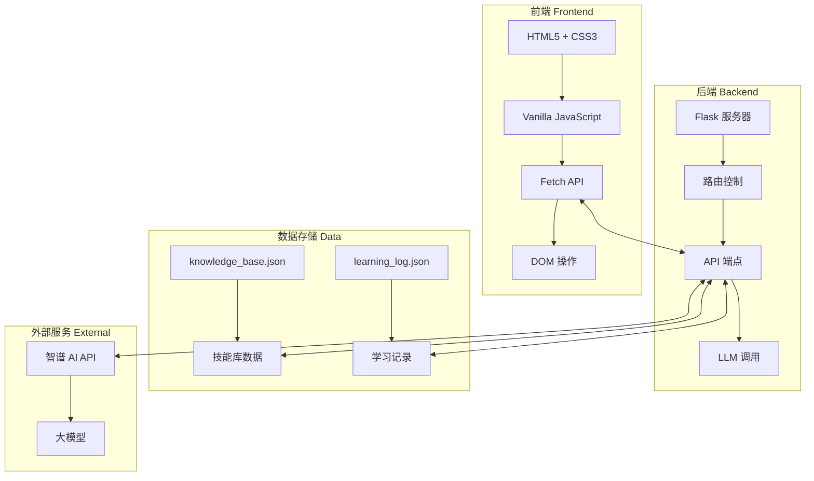
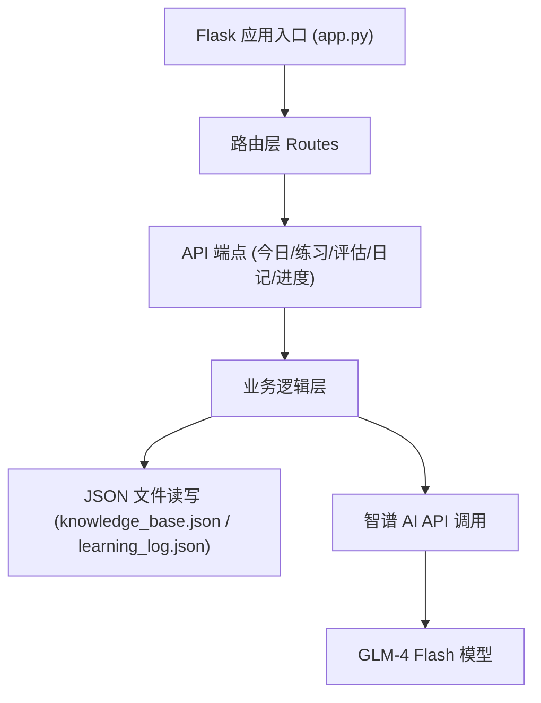
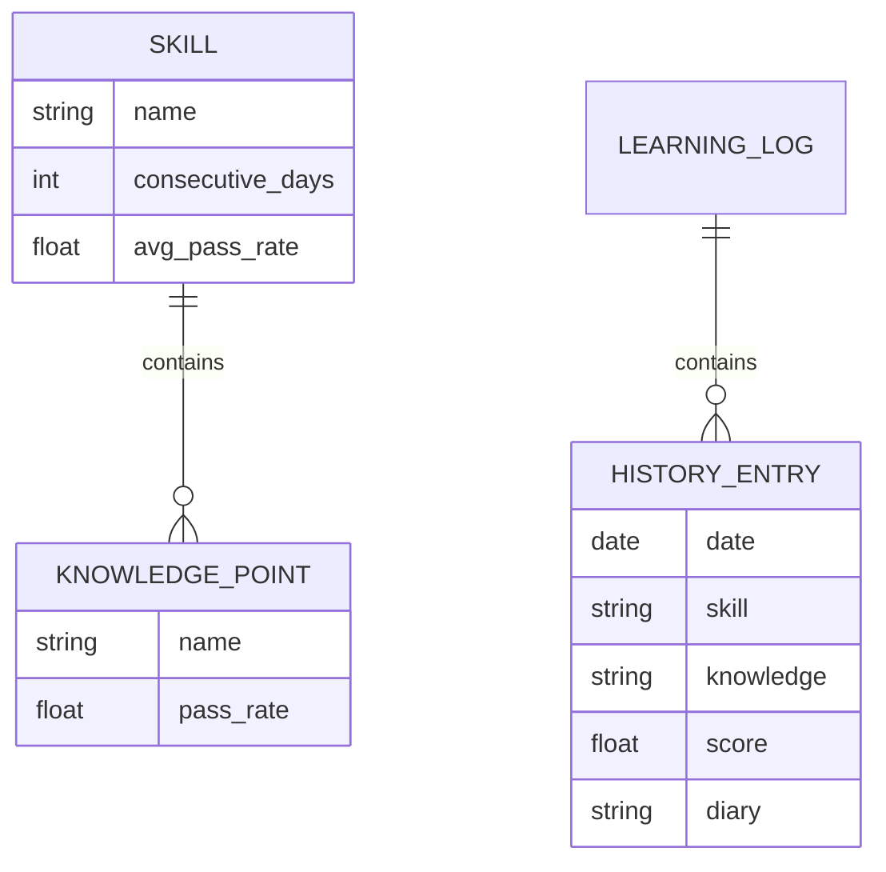

# 产品经理进化论 - 技术架构文档

## 1. Architecture Design



## 2. Technology Description

- **前端**：Vanilla HTML5 + CSS3 + JavaScript (ES6+)
- **后端**：Flask@2
- **数据存储**：JSON 文件本地存储
- **外部服务**：智谱 AI API (GLM-4)

## 3. Route Definitions

| Route | Purpose |
|-------|---------|
| / |首页 - 今日学习页面 |
| /progress |技能进度页面 |
| /history |学习历史页面 |
| /api/today |获取今日学习内容 |
| /api/exercise |获取练习题 |
| /api/evaluate |提交答案并获取评估 |
| /api/diary |生成学习日记 |
| /api/complete |完成今日学习 |
| /api/progress |获取技能进度数据 |
| /api/history |获取学习历史 |

## 4. API Definitions

### 4.1 获取今日学习内容
```typescript
// GET /api/today
interface TodayResponse {
  skill_name: string;
  knowledge_point: string;
  explanation: string;
}
```

### 4.2 获取练习题
```typescript
// GET /api/exercise
interface ExerciseResponse {
  question: string;
  reference_answer: string;
}
```

### 4.3 评估答案
```typescript
// POST /api/evaluate
interface EvaluateRequest {
  question: string;
  user_answer: string;
  reference_answer: string;
}

interface EvaluateResponse {
  score: number;
  feedback: string;
}
```

### 4.4 生成日记
```typescript
// POST /api/diary
interface DiaryRequest {
  knowledge_point: string;
  score: number;
  feedback: string;
}

interface DiaryResponse {
  diary: string;
}
```

### 4.5 进度数据
```typescript
// GET /api/progress
interface ProgressResponse {
  total_points: number;
  mastered_points: number;
  avg_score: number;
  total_days: number;
  skills: SkillProgress[];
}

interface SkillProgress {
  name: string;
  consecutive_days: number;
  avg_pass_rate: number;
  knowledge_points: PointProgress[];
}

interface PointProgress {
  name: string;
  pass_rate: number;
}
```

### 4.6 学习历史
```typescript
// GET /api/history
interface HistoryResponse {
  history: HistoryItem[];
}

interface HistoryItem {
  date: string;
  skill: string;
  knowledge: string;
  score: number;
  diary: string;
}
```

## 5. Server Architecture Diagram (if backend exists)



## 6. Data Model (if applicable)

### 6.1 Data Model Definition



### 6.2 Data Definition Language

知识库存放在 knowledge_base.json，学习历史存放在 learning_log.json，无需 SQL DDL。

