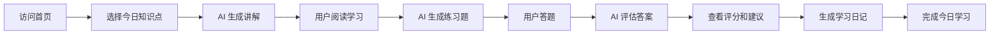

# 产品经理进化论 - 产品需求文档

## 1. Product Overview

AI驱动的产品经理学习系统，每日推送精选知识点，通过交互式问答和评估帮助用户系统提升产品能力。
- 目标用户：产品经理、产品新人、想转行做产品的人员
- 核心价值：提供系统化、个性化的产品能力成长路径

## 2. Core Features

### 2.1 User Roles (if applicable)

| Role | Registration Method | Core Permissions |
|------|---------------------|------------------|
| Normal User |无需登录 |使用所有功能，查看学习进度和历史 |

### 2.2 Feature Module

1. **首页（今日学习）**：Hero 区域、学习步骤进度条、知识点讲解、练习题、评估反馈、学习日记
2. **技能进度页**：技能模块概览、各知识点掌握情况、统计数据
3. **学习历史页**：日历视图、每日学习记录、学习趋势统计

### 2.3 Page Details

| Page Name | Module Name | Feature description |
|-----------|-------------|---------------------|
| 首页 | Hero 区域 |品牌标语、核心价值描述、激励性文案 |
| 首页 | 学习步骤进度条 |4步学习流程可视化指示（讲解→练习→评估→日记） |
| 首页 | 知识点讲解 |AI生成的深入浅出的知识点解析 |
| 首页 | 练习题 |基于知识点的面试题/实践题 |
| 首页 | 用户答案输入 |支持长文本输入的答案区域 |
| 首页 | AI 评估反馈 |0-10分评分 + 改进建议 |
| 首页 | 学习日记 |自动生成的今日学习总结 |
| 技能进度页 | 统计卡片 |总知识点数、达标数、平均得分、学习天数 |
| 技能进度页 | 技能模块卡片 |8大产品能力模块，带进度条 |
| 学习历史页 | 历史记录卡片 |每日学习记录卡片，带得分和日记 |

## 3. Core Process

用户访问首页 → 系统选择今日知识点 → AI生成讲解内容 → 用户阅读 → AI生成练习题 → 用户答题 → AI评估答案 → 用户查看反馈 → 生成学习日记 → 完成今日学习。

## 4. User Interface Design

### 4.1 Design Style
- **主色调**：深紫色 (#6366f1) + 青绿色 (#10b981)
- **按钮风格**：圆角大按钮，带有轻微悬浮动画和阴影
- **字体**：Inter / 思源黑体 为主，标题粗体，正文中等字重
- **布局风格**：卡片式布局，居中对齐，强调垂直节奏
- **图标风格**：Emoji 为主（🚀, ⚡, 📚, ✨），营造轻松但专业的氛围

### 4.2 Page Design Overview

| Page Name | Module Name | UI Elements |
|-----------|-------------|-------------|
| 首页 | Hero 区域 |渐变背景、大标题、副标题、垂直间距 |
| 首页 | 步骤进度条 |圆形数字节点、连接线、激活/未激活状态区分 |
| 首页 | 内容卡片 |白色背景、圆角、阴影、柔和边框 |
| 技能进度页 | 统计卡片 |网格布局、渐变色背景、数据动画 |
| 技能进度页 | 技能模块 |进度条动画、展开/折叠交互 |
| 学习历史页 | 时间线卡片 |按时间倒序、悬停效果、得分高亮 |

### 4.3 Responsiveness

Desktop-first 设计，自适应屏幕宽度；移动端优化字体大小和间距，确保触摸友好。

### 4.4 3D Scene Guidance (if applicable)
- 无需 3D 场景

